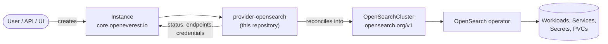

# OpenSearch Provider

> [!WARNING]
> **Pre-alpha.** OpenEverest v2 and this provider are under active development. CRD schemas,
> chart values and defaults change frequently, including in breaking ways, and there is no
> supported upgrade path between versions yet. Not for production use.

<!-- TODO(sdk): remove the pre-alpha banner and the status badge at v2 GA. -->

[](https://github.com/openeverest/openeverest)
[](https://github.com/openeverest/provider-opensearch/actions/workflows/ci.yaml)
[](https://github.com/openeverest/provider-opensearch/releases)
[](https://pkg.go.dev/github.com/openeverest/provider-opensearch)
[](LICENSE)

Run **OpenSearch** on Kubernetes through [OpenEverest](https://github.com/openeverest/openeverest),
backed by the [OpenSearch Kubernetes Operator](https://github.com/opensearch-project/opensearch-k8s-operator).

## What this is

OpenEverest providers translate a single, technology-agnostic `Instance` custom resource into
the native custom resources of an upstream Kubernetes operator — for databases, but equally
for caches, message queues, object storage, or model-serving runtimes. This repository is the
provider for OpenSearch: it owns the technology-specific knowledge — topologies, versions,
parameters, backup wiring — so that users, the API server, and the UI stay technology-agnostic.

> [!IMPORTANT]
> **This provider is not standalone.** It requires an OpenEverest installation (core CRDs and
> controller) in the cluster. Installing this chart on its own does nothing.
> See [Install OpenEverest](https://openeverest.io/documentation/current/quick-install.html).



The provider watches `Instance` resources whose `spec.providerRef.name` is
`opensearch`, and reports workload health back onto `Instance.status`. It never
manages pods directly — all lifecycle work is delegated to the operator.

## Compatibility

| provider-opensearch | OpenEverest | OpenSearch operator | OpenSearch | Kubernetes |
|---|---|---|---|---|
| `0.1.x` | `2.0.0-dev.3` | `3.0.x` (chart `3.0.14`) | `3.7`, `3.8` | `1.30` – `1.34` |

## Capabilities

What you can do to a running instance through the `Instance` API. Upgrading the
provider itself is covered under [Installation](#installation). See [ROADMAP.md](ROADMAP.md)
for what is planned next.

| Capability | Status | Notes |
|---|---|---|
| Provisioning | ✅ | `standard` topology |
| Horizontal scaling | ✅ | `spec.components.engine.replicas` |
| Vertical scaling (CPU / memory) | ✅ | `spec.components.engine.resources`; the JVM heap is half the memory request |
| Version upgrades | ❌ | |
| Custom configuration | ❌ | |
| Monitoring | ❌ | |
| TLS | ✅ | Operator-generated certificates for transport and HTTP, always on |

Stateful workloads additionally report:

| Capability | Status | Notes |
|---|---|---|
| Persistent storage | ✅ | `spec.components.engine.storage`; volumes are deleted with the Instance |
| Storage expansion | ❌ | |
| Backups (on demand) | ❌ | |
| Backups (scheduled) | ❌ | |
| Restore | ❌ | |

## Installation

The provider chart is published as an OCI artifact:

```bash
helm install provider-opensearch \
  oci://ghcr.io/openeverest/charts/provider-opensearch \
  --version <chart-version> \
  --namespace everest-system
```

- The OpenSearch operator (and its CRDs) is bundled as a chart dependency and is installed
  automatically. Set `operator.enabled=false` if the operator is already installed.
- The operator's validating webhooks are disabled by default because they require
  cert-manager; enable `operator.webhook.enabled` and `operator.webhook.certManager.enabled`
  together if cert-manager is available. The provider's own `Validate` step rejects the same
  unsafe changes (version downgrades, upgrades that skip a major version, storage class
  changes) without them, so enabling the webhooks is defense-in-depth, not a requirement.

Upgrade and uninstall:

```bash
helm upgrade provider-opensearch oci://ghcr.io/openeverest/charts/provider-opensearch
helm uninstall provider-opensearch --namespace everest-system
```

Uninstalling the chart does **not** delete running `Instance` resources or their data.

## Usage

Verify that the provider registered itself:

```bash
kubectl get providers.core.openeverest.io opensearch
```

Create an instance:

```yaml
apiVersion: core.openeverest.io/v1alpha1
kind: Instance
metadata:
  name: my-instance
spec:
  providerRef:
    name: opensearch
  components:
    engine:
      replicas: 3
      resources:
        limits:
          cpu: "1"
          memory: 4Gi
      storage:
        size: 10Gi
```

Component names are defined by this provider — see [definition/provider.yaml](definition/provider.yaml).
`spec.version` and `spec.topology` are optional; the provider defaults apply.
More examples live in [examples/](examples/).

Watch it come up and read the connection details:

```bash
kubectl get instance my-instance -w
kubectl get secret "$(kubectl get instance my-instance -o jsonpath='{.status.connectionSecretRef.name}')" -o yaml
```

The connection secret holds the HTTPS endpoint (`host`, `port`, `uri`) of the cluster's
client service and the `admin` user's credentials. The HTTP certificate is signed by a CA the
operator generates per cluster (secret `<instance>-ca`).

## Topologies

<!-- TODO(sdk): these blocks are hand-maintained until `provider-sdk generate` fills them
     from definition/. Until then, update them whenever definition/ changes. -->

<!-- BEGIN GENERATED: topologies -->
| Topology | Default | Description |
|---|---|---|
| `standard` | ✅ | One node pool (`engine`); every node is cluster-manager eligible, holds data and runs ingest pipelines. 3 nodes by default |
<!-- END GENERATED: topologies -->

## Versions

<!-- BEGIN GENERATED: versions -->
| Version bundle | Default | opensearch |
|---|---|---|
| `3.8.0` | ✅ | `3.8.0` |
| `3.7.0` | | `3.7.0` |
<!-- END GENERATED: versions -->

Source of truth: [definition/versions.yaml](definition/versions.yaml).

Version upgrades are not exposed as a feature yet; see [ROADMAP.md](ROADMAP.md). `Validate`
already rejects unsafe `spec.components.engine.version` changes (downgrades, upgrades that
skip a major version) so a user cannot break a running cluster in the meantime.

## Configuration

- **Chart values:** [charts/provider-opensearch/values.yaml](charts/provider-opensearch/values.yaml)
- **Instance parameters:** per-component and per-topology `parameters` schemas, defined under
  [definition/](definition/) and published on the `Provider` resource
  (`kubectl get provider opensearch -o yaml`). The API server and the UI validate
  user input against these schemas.

Worth knowing:

- **Memory** — the operator gives the JVM half of the memory request as heap. Requests default
  to the limits when only limits are set; the minimum is `2Gi`.
- **Instance name** — at most 36 characters, since the operator derives Kubernetes object
  names from it.
- **Storage class** — cannot be changed after creation.
- **Version changes** — downgrades and upgrades that skip a major version are rejected; see
  [Versions](#versions).

## Development

Requires Go (see [go.mod](go.mod)), Docker, Helm, kubectl, and a Kubernetes cluster you can
reach. [dev/README.md](dev/README.md) covers the environment end to end: the recommended
local k3d setup, running against a cluster you already have, and every `dev/.env` setting.

```bash
make dev-up             # local cluster + Tilt dev environment (see dev/README.md)
make generate           # RBAC, provider spec, Helm chart sync
make run                # run the provider locally against the cluster
make test-unit
make test-integration   # chainsaw suites under test/integration/
make dev-down
```

`make help` lists every target. `make verify` fails when generated files are stale — run
`make generate` and commit the result.

The provider contract (`Validate` / `Sync` / `Status` / `Cleanup`), RBAC markers, watches,
code generation, and the backup/restore interfaces are documented once for all providers in
[PROVIDER_DEVELOPMENT.md](https://github.com/openeverest/provider-sdk/blob/main/PROVIDER_DEVELOPMENT.md).

### Layout

| Path | Purpose |
|---|---|
| `cmd/provider/` | Entry point |
| `internal/provider/` | `ProviderInterface` implementation, backup interfaces, RBAC markers |
| `internal/common/` | Component name constants |
| `definition/` | Provider identity, component types, versions, topologies, backup classes |
| `charts/provider-opensearch/` | Helm chart (`generated/` is produced by `make generate`) |
| `config/rbac/role.yaml` | Generated `ClusterRole` — do not edit |
| `test/integration/` | Chainsaw suites (see its `README.md`) |
| `test/vars.sh` | Pinned operator and workload versions used by tests |
| `examples/` | Example `Instance` resources |
| `dev/` | Tilt dev environment, `.env` configuration, k3d cluster config |
| `.github/workflows/` | CI: lint, build, unit and integration tests, release |

### Testing

- **Unit tests** — `make test-unit`, including the provider-runtime conformance checks
  that every UI field and supported field is consumed by `Sync`.
- **Integration tests** — chainsaw suites under `test/integration/`. The `core/` suite runs
  without the operator and simulates it by patching the `OpenSearchCluster` status. See
  [test/integration/README.md](test/integration/README.md).
- **CI** — `.github/workflows/ci.yaml` runs lint, build, unit tests, generated-file
  verification, Helm lint, and each integration suite on every pull request.

## Troubleshooting

```bash
kubectl logs -n everest-system deploy/provider-opensearch -f
```

| Symptom | Where to look |
|---|---|
| `Instance` stuck in `Creating` | `kubectl describe instance <name>` conditions, then the provider logs |
| No `Provider` resource in the cluster | Is the chart installed? Check the provider deployment logs |
| `Instance` ignored entirely | `spec.providerRef.name` must be `opensearch` |
| Operator resource created but no pods | `kubectl get opensearchcluster <name> -o yaml` — the failure is upstream; check the operator logs |
| Pods crash with `max virtual memory areas vm.max_map_count` | The operator sets it through a privileged init container; the cluster's pod security settings must allow it |

## Contributing

Issues and pull requests are welcome. See
[PROVIDER_DEVELOPMENT.md](https://github.com/openeverest/provider-sdk/blob/main/PROVIDER_DEVELOPMENT.md)
and the [OpenEverest Code of Conduct](https://github.com/openeverest/openeverest/blob/main/CODE_OF_CONDUCT.md).

## Security

Report vulnerabilities per the
[OpenEverest security policy](https://github.com/openeverest/openeverest/blob/main/SECURITY.md).
Please do not open public issues for security reports.

## License

Apache License 2.0 — see [LICENSE](LICENSE) for details.
