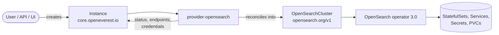

# provider-opensearch — Roadmap

This roadmap describes how the OpenEverest provider for OpenSearch is built: what the MVP
contains, and which capabilities are added afterwards, in which order and why.

The provider translates an OpenEverest `Instance` (`core.openeverest.io/v1alpha1`) into an
`OpenSearchCluster` (`opensearch.org/v1`) reconciled by the community
[OpenSearch Kubernetes Operator](https://github.com/opensearch-project/opensearch-k8s-operator).
It is scaffolded with [provider-sdk](https://github.com/openeverest/provider-sdk) and follows the
conventions of [provider-percona-server-mongodb](https://github.com/openeverest/provider-percona-server-mongodb).

---

## Baseline decisions

| Topic | Decision | Notes |
|---|---|---|
| Operator | OpenSearch operator **3.0.x** (chart `opensearch-operator` 3.0.14) | Bundled as a Helm chart dependency, `legacyAPI.enabled=false` |
| Operator API | `opensearch.org/v1` only | The legacy `opensearch.opster.io` group is not used |
| Go dependency | `.../opensearch-k8s-operator/opensearch-operator` pinned by **pseudo-version** of the `opensearch-operator-3.0.14` commit | Upstream tags are not Go-module compliant; only the `api/opensearch.org/v1` package is imported. Verified to build against `openeverest/v2 v2.0.0-dev.3` (k8s 0.37, controller-runtime 0.25) |
| OpenSearch versions | Latest **3.x** is the default bundle | Operator 3.0 supports 2.19.2 → latest 3.x; a 2.19.x bundle is optional |
| Provider name | `opensearch` | Module `github.com/openeverest/provider-opensearch`, chart `provider-opensearch` |
| Component types | `opensearch`, later `dashboards` | All node pools share the `opensearch` type (same image/version) |
| Credentials | Operator-generated admin secret (`<name>-admin-password`) | Custom bootstrap credentials come later via `spec.userSecretRef` |
| TLS | Always on, operator-generated (transport + HTTP) | Never expose an unauthenticated / plaintext cluster |

### Component and topology model

| Component | Type | OpenSearch node roles | Introduced in |
|---|---|---|---|
| `engine` | `opensearch` | `cluster_manager`, `data`, `ingest` (MVP) → `data`, `ingest` (dedicated topology) | MVP |
| `clusterManager` | `opensearch` | `cluster_manager` | M4 |
| `coordinator` | `opensearch` | none (coordinating-only) | M4 |
| `dashboards` | `dashboards` | — (OpenSearch Dashboards deployment) | M2 |

| Topology | Components | Introduced in |
|---|---|---|
| `standard` (default) | `engine` (+ optional `dashboards`) | MVP |
| `dedicated` | `clusterManager`, `engine`, optional `coordinator`, optional `dashboards` | M4 |

---

## Milestones at a glance

The **MVP is M0 + M1**: M0 is the prerequisite groundwork, M1 is the functional scope. Everything
from M2 onwards is post-MVP.

| Milestone | Version | Theme |
|---|---|---|
| [M0](#m0--foundation-mvp-part-1) | — | **MVP part 1**: scaffold, dependencies, CI, dev loop |
| [M1](#m1--mvp) | `0.1.0` | **MVP part 2**: provision, connect, scale, delete a secure OpenSearch cluster |
| [M2](#m2--day-2-operations-and-dashboards) | `0.2.0` | Day-2 operations (upgrades, storage expansion, config, exposure) + Dashboards |
| [M3](#m3--backup-and-restore) | `0.3.0` | Snapshots: on-demand, scheduled, restore, new Instance from backup |
| [M4](#m4--dedicated-roles-topology) | `0.4.0` | Dedicated cluster-manager / data / coordinator topology |
| [M5](#m5--monitoring) | `0.5.0` | Monitoring |
| [M6](#m6--security-and-access) | `0.6.0` | Custom credentials, custom TLS, users & roles |
| [M7](#m7--production-hardening) | `1.0.0` | Upgrade preflight, maintenance gating, e2e UI tests, docs |
| [Backlog](#backlog) | — | Hot/warm/cold, ISM, plugins, gRPC, … |

---

## M0 — Foundation (MVP, part 1)

Goal: an empty-but-working provider that registers itself in OpenEverest and passes CI. First
step of the MVP — M1 builds directly on it.

- [x] `provider-sdk init --name opensearch --module github.com/openeverest/provider-opensearch --api-group opensearch.org --resource opensearchclusters`
- [x] Keep the SDK-templated `README.md`, `.github/workflows` (ci, build, release, integration-test), `Makefile`, `Dockerfile`, `dev/`
- [x] Add the operator API dependency (pseudo-version) and register `opensearchv1.AddToScheme` in `SchemeFuncs`
- [x] Chart: add `opensearch-operator` 3.0.14 as a dependency (alias `operator`), `installCRDs: true`, `legacyAPI.enabled: false`
- [x] `dev/Tiltfile` + k3d config: OpenEverest core + operator + provider live-reload
- [x] RBAC markers for `opensearchclusters` (+ `/status`), secrets
- [ ] `make generate` / `make verify` green in CI

**Done when:** `kubectl get provider opensearch` shows the generated spec and CI is green.

---

## M1 — MVP

Goal: a user can create a **secure, single-topology OpenSearch 3.x cluster** from the OpenEverest
UI or API, connect to it, scale it, and delete it.

### Scope

**Definition (`definition/`)**
- [x] `provider.yaml`: component `engine` of type `opensearch`
- [x] `versions.yaml`: `opensearch` component type with the latest 3.x images (`opensearchproject/opensearch:<v>`); one default bundle, optionally one previous 3.x bundle
- [x] Topology `standard`: `engine` with defaults `replicas: 3`, supported fields `replicas`, `resources`, `storage`, `schedulingPolicy` (all but `schedulerName`)
- [x] UI schema: version select, number of nodes, CPU / memory, disk size, storage class (`dataSource: storageClasses`)

**Sync (`Instance` → `OpenSearchCluster`)**

| Instance | OpenSearchCluster |
|---|---|
| `metadata.name` | `metadata.name`, `spec.general.serviceName` |
| resolved `engine` version / image | `spec.general.version`, `spec.general.image` |
| `components.engine.replicas` | `spec.nodePools[0].replicas` (component `nodes`) |
| `components.engine.resources` | `spec.nodePools[0].resources`; requests default to limits because the operator sizes the heap at 50% of the memory request |
| `components.engine.storage.size` / `storageClass` | `spec.nodePools[0].diskSize`, `persistence.pvc.storageClass` |
| `components.engine.schedulingPolicy` | `affinity`, `tolerations`, `nodeSelector`, `topologySpreadConstraints` |
| — (fixed) | roles `[cluster_manager, data, ingest]`, `security.tls.{transport,http}.generate: true`, `confMgmt.smartScaler: true`, PVC retention `whenDeleted: Delete` |

- [x] Single `c.Apply()` of the full CR (owner reference set by runtime) — idempotent on every reconcile
- [x] Default anti-affinity (preferred) across nodes

**Status (`OpenSearchCluster.status` → `Instance.status`)**

| Operator state | Instance phase |
|---|---|
| CR missing, `phase: PENDING`, or `initialized: false` | `Provisioning` |
| `phase: UPGRADING` | `Updating` |
| `phase: RUNNING`, `health: green` or `yellow` | `Ready` (yellow reported in the message) |
| `phase: RUNNING`, fewer available nodes than replicas | `Updating` |
| `phase: RUNNING`, `health: red` | `Updating` with message (not `Failed`: red is usually transient during restarts) |

- [x] Connection details: `https://<name>.<namespace>.svc:9200`, `type: opensearch`, username/password from `<name>-admin-password`
- [ ] Per-component status for `engine` (available nodes vs. desired replicas) — not yet consumed by provider-runtime

**Validate**
- [x] Instance name: RFC 1035, at most 36 characters (operator-derived Job and StatefulSet revision labels must fit 63)
- [x] `engine.replicas >= 1`
- [x] Minimum resources (memory `>= 2Gi`, CPU `>= 500m`) and storage (`>= 1Gi`) — revisit after load testing
- [x] Reject storage shrink
- [ ] Reject version downgrade (the operator webhook does this, but it is disabled without cert-manager)

**Cleanup**
- [x] Delete the `OpenSearchCluster`, wait until it is gone, then delete the operator secrets that have no owner reference (`<name>-admin-password`, `<name>-dashboards-password`)

**Quality**
- [x] Unit tests: spec mapping, resources defaulting, status mapping, validation, provider-runtime conformance
- [x] Chainsaw integration suite `core`: create → assert CR shape → ready → scale → delete (operator disabled, CR asserted)
- [ ] Chainsaw e2e-cluster suite with the real operator on k3d: Instance reaches `Ready`, connection works (verified manually)
- [x] README capabilities table + compatibility table filled in; `examples/instance-simple.yaml`

### Capabilities at MVP

| Capability | Status | Notes |
|---|---|---|
| Provisioning | ✅ | `standard` topology |
| Horizontal scaling | ✅ | `spec.components.engine.replicas` |
| Vertical scaling (CPU / memory) | ✅ | JVM heap follows memory; operator performs a rolling restart |
| TLS | ✅ | Operator-generated certificates, always on |
| Persistent storage | ✅ | PVC per node |

### Explicitly out of MVP

Dashboards, backups/restore, dedicated roles topology, monitoring, custom credentials / TLS,
custom `opensearch.yml`, external exposure, version upgrades, storage expansion.

**Done when:** a 3-node OpenSearch 3.x cluster created from the UI reaches `Ready`, is
reachable with the published credentials over HTTPS, can be scaled up/down, and is fully
removed on deletion — covered by CI.

---

## M2 — Day-2 operations and Dashboards

Most of these are natively handled by the operator; the provider work is mapping + validation.

- [ ] **Version upgrades** — change `spec.version`; operator performs a rolling upgrade. Validate: no downgrade, no jump over more than one major version
- [ ] **Storage expansion** — `engine.storage.size` increase → `diskSize`; validate StorageClass `allowVolumeExpansion`, keep the same unit (`Gi`)
- [ ] **Custom configuration** — `engine.parameters.configuration` (`opensearch.yml` fragment) → `nodePools[].additionalConfig`; block keys the provider owns (TLS, security, discovery)
- [ ] **Service exposure** — `engine.service` (`ClusterIP` / `LoadBalancer`, annotations, source ranges) → `general.annotations` / service type
- [ ] **Dashboards** — optional `dashboards` component (type `dashboards`, image `opensearchproject/opensearch-dashboards`, version pinned in the same bundle as the engine): replicas, resources, service exposure, generated TLS
- [ ] Plugins list parameter (`general.pluginsList`) — curated, since plugins are downloaded at pod start
- [ ] Chainsaw suites: upgrade, storage expansion, dashboards

| Capability | Status |
|---|---|
| Version upgrades | ✅ |
| Storage expansion | ✅ |
| Custom configuration | ✅ |

---

## M3 — Backup and restore

OpenSearch backups are **snapshots** into a registered repository (S3 via the `repository-s3`
plugin). The operator only registers repositories (`general.snapshotRepositories`) and manages
scheduled **Snapshot Management** policies (`OpensearchSnapshotPolicy`); it has **no on-demand
snapshot or restore CR**. `Instance.spec.dataSource` requires a `ProviderManaged` BackupClass, so
the provider drives snapshots itself through the OpenSearch REST API.

- [ ] BackupClass `opensearch-snapshot` (`executionMode: ProviderManaged`, `supportsPITR: false`)
- [ ] `spec.backup.storages[]` → `general.snapshotRepositories[]` (S3 / S3-compatible, e.g. MinIO); add `repository-s3` to `pluginsList`
- [ ] S3 credentials from `BackupStorage` secret → `general.keystore` (`s3.client.<name>.access_key` / `secret_key`); handle the rolling restart caused by keystore changes (or `_nodes/reload_secure_settings`)
- [ ] Authenticated REST client in the provider (admin credentials + operator-generated CA) — shared helper, used by backup, restore and status
- [ ] **On-demand backup** — `SyncBackup`: `PUT _snapshot/<repo>/<backup-name>`, poll `GET _snapshot/<repo>/<name>` → `BackupExecutionStatus` (state, start/end, size)
- [ ] **Backup deletion** — `CleanupBackup`: `DELETE _snapshot/<repo>/<name>` when `deletionPolicy: Delete`
- [ ] **Scheduled backups** — `storages[].schedules[]` → `OpensearchSnapshotPolicy` (cron, `deleteCondition.maxCount = retentionCopies`)
- [ ] **Mirror scheduled snapshots** into `Backup` CRs — snapshots are not Kubernetes objects, so `BackupMirror` (which watches an operator CR) does not fit as-is; see [open questions](#open-questions)
- [ ] **Restore in place** — `SyncRestore`: close/delete target indices, `POST _snapshot/<repo>/<name>/_restore`, track recovery → `RestoreExecutionStatus`; Instance reports `Restoring`
- [ ] **New Instance from backup** — `spec.dataSource`: provision, then restore once the cluster is `Ready`
- [ ] Dev: MinIO + `BackupStorage` manifests in `dev/resources/`; Chainsaw `backup` suite

| Capability | Status | Notes |
|---|---|---|
| Backups (on demand) | ✅ | Snapshot API |
| Backups (scheduled) | ✅ | Snapshot Management policies |
| Restore | ✅ | In place and via `spec.dataSource` |
| Point-in-time recovery | — | Not supported by OpenSearch; row removed from README |

---

## M4 — Dedicated roles topology

For larger / production clusters: separate cluster-manager quorum from data nodes.

- [ ] Topology `dedicated`: `clusterManager` (3 replicas, small disk), `engine` (data + ingest), optional `coordinator` (no roles, no disk, client-facing service)
- [ ] One `nodePools[]` entry per component; main service points to coordinators when present
- [ ] Validation: odd `clusterManager` replicas (`>= 3` recommended); `coordinator` has no storage
- [ ] Topology switching (`standard` ↔ `dedicated`) on a live Instance: define whether it is supported or rejected
- [ ] UI schema with component groups per role; Chainsaw `core/dedicated` suite

---

## M5 — Monitoring

OpenEverest `MonitoringConfig` currently supports only **PMM**, which has no native OpenSearch
integration. The operator ships the Prometheus exporter plugin plus a `ServiceMonitor`.

- [ ] Decide the integration path with OpenEverest core (new `MonitoringConfig` type vs. PMM external exporter)
- [ ] Optional `monitoring` component → `general.monitoring` (exporter plugin, dedicated low-privilege monitoring user, scrape interval)
- [ ] Air-gapped support via `pluginUrl`

| Capability | Status |
|---|---|
| Monitoring | ✅ |

---

## M6 — Security and access

- [ ] **Bootstrap credentials** — `spec.userSecretRef` → `security.config.adminCredentialsSecret`
- [ ] **Custom TLS** — user-provided certificates / cert-manager issuer instead of operator-generated ones; certificate rotation settings
- [ ] **Users and roles** (optional) — expose `OpensearchUser` / `OpensearchRole` management via Instance-scoped `secrets` definitions, if OpenEverest core grows a user-management concept
- [ ] Dashboards credentials and multi-tenancy defaults

---

## M7 — Production hardening

- [ ] **Upgrade preflight** (`UpgradeProvider.CheckUpgrade`) — block provider/operator upgrades that would break running Instances
- [ ] **Maintenance gating** — route provider-induced rolling restarts (defaults change, operator bump) through `RequestMaintenance`
- [ ] `drainDataNodes` defaults and PodDisruptionBudgets per node pool
- [ ] InstancePresets (small / medium / large)
- [ ] Playwright e2e tests against the OpenEverest UI
- [ ] Complete README (topologies, versions, parameters, troubleshooting); remove pre-alpha banner at OpenEverest v2 GA

---

## Backlog

Not scheduled; picked up based on demand.

- Hot / warm / cold data tiers (node attributes + ISM)
- ISM policies, index / component templates as provider-managed resources
- gRPC transport (OpenSearch 3.x)
- Curated plugin catalog (k-NN, ML Commons, analysis plugins) and offline plugin mirrors
- Snapshot repositories beyond S3 (GCS, Azure)
- Zone / rack awareness via `nodeAttributes`
- Suspend / resume, if exposed by OpenEverest core
- OpenSearch 2.19.x bundle for users that cannot move to 3.x yet

---

## Open questions

1. **Mirroring scheduled snapshots** — `BackupMirror` watches an operator CR, but SM snapshots only
   exist in the OpenSearch API. Options: poll snapshots during `Sync` and create `Backup` CRs
   directly; run schedules from the provider instead of SM; or extend provider-runtime with a
   polling mirror.
2. **Provider → cluster connectivity** — backup/restore needs the provider pod to reach every
   Instance over HTTPS (NetworkPolicies, CA trust). Confirm this is acceptable versus a Job-based
   approach.
3. **Restore semantics** — which indices are restored and how conflicts with existing indices are
   handled (close + overwrite, rename pattern, or require an empty cluster).
4. **Health `yellow`** — confirm that `yellow` is acceptable for `Ready` (single-node clusters are
   always yellow when indices have replicas).
5. **Dashboards as a component vs. a toggle** — a component fits the model and UI, but it is not a
   database node; confirm with OpenEverest core conventions.
6. **Minimum resources** — the JVM needs meaningful memory; finalize minimums and heap ratio after
   load testing.

## Compatibility (target)

| provider-opensearch | OpenEverest | OpenSearch operator | OpenSearch | Kubernetes |
|---|---|---|---|---|
| `0.1.x` | `2.0.0-dev.3` | `3.0.x` | `3.x` | `1.30` – `1.34` |
